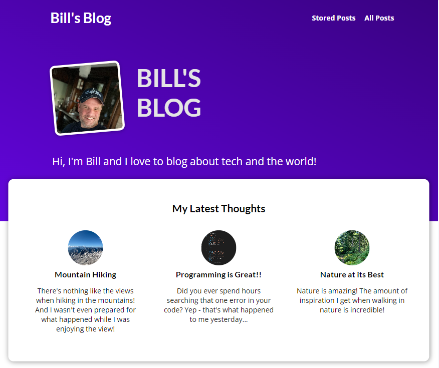
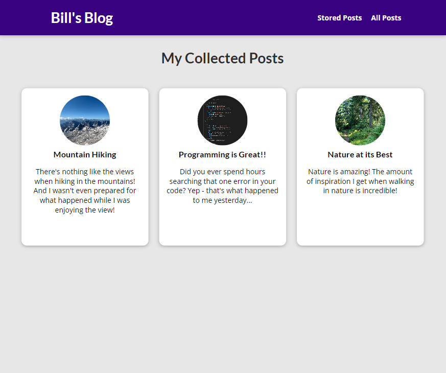
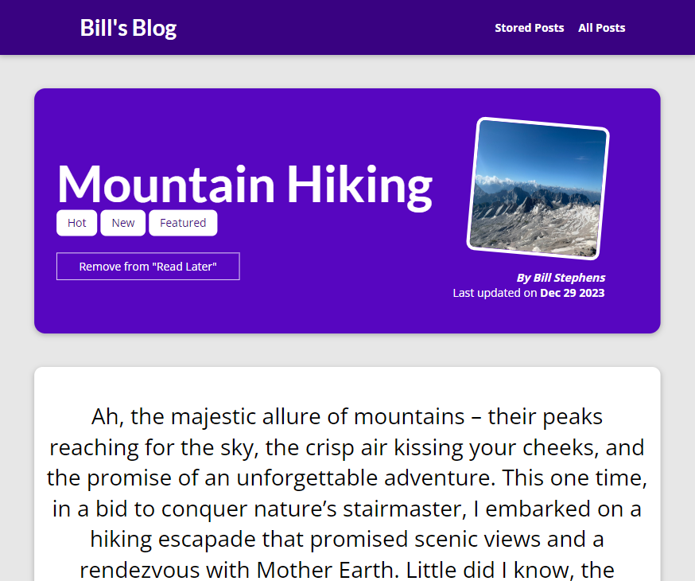
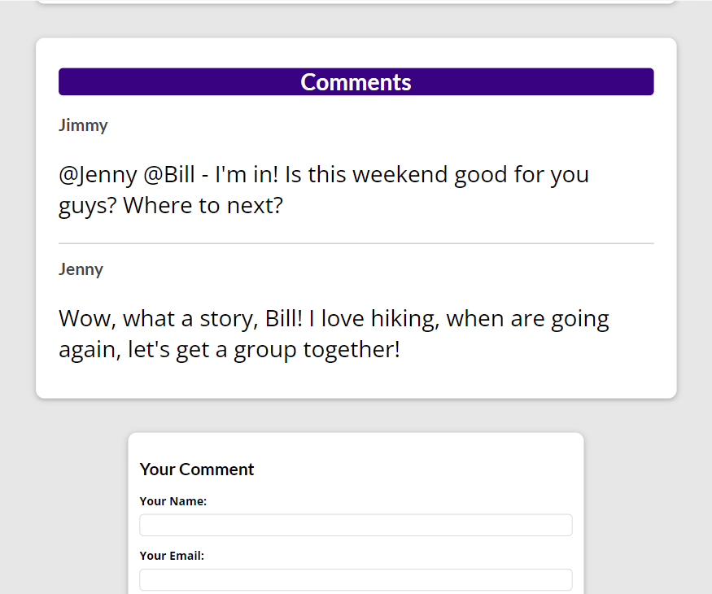
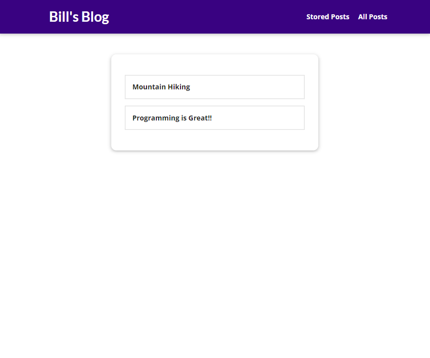

# Blog - Django 

  ## Description

  A personal Blog application built using Django (Python) and PostgreSQL. Admin users create Blog posts and site visitors can view posts, comment on posts, & save posts to read later.  PostgreSQL used for database storage. Deployed using AWS' Elastic Beanstalk.

  ### App Screenshots

  ## Home Page

  

  ## All Posts Page

  

  ## Single Posts Page

  

  
  ## Comment on Individual Post

  

  ## Saved Posts Page

  
  
  ## Table of Contents
  
  - [Installation](#installation)
  - [Usage](#usage)
  - [License](#license)
  - [Contributing](#contributing)
  - [Tests](#tests)
  - [Questions](#questions)
  
  ## Installation
  
  Deployed URL:  http://django-blog-env-1.eba-7pfn6c3t.us-east-2.elasticbeanstalk.com/
  
  ## Usage
  
  Visit deployed URL, view posts, comment on individual posts, or save individual posts to read later.

  ## License
This application is covered under the MIT License.
 For more information: https://opensource.org/licenses/MIT
  
  ## Contributing
  N/A
  
  ## Tests
  N/A

  ## Questions
  Contact Info 
  GitHub user name: BillStephens2022 
  Link to GitHub profile: https://github.com/BillStephens2022 
  Email: stephensbill17@gmail.com